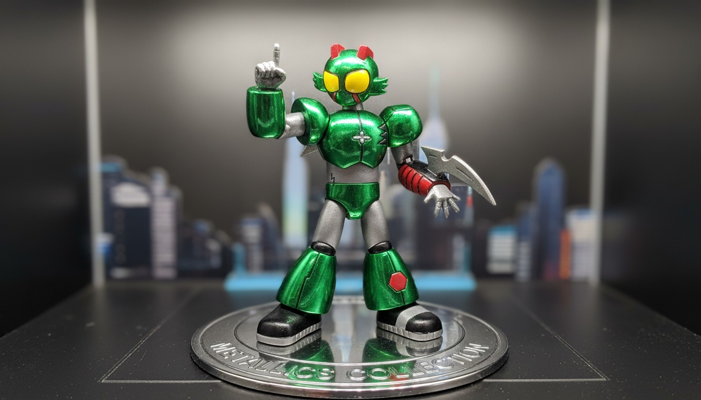
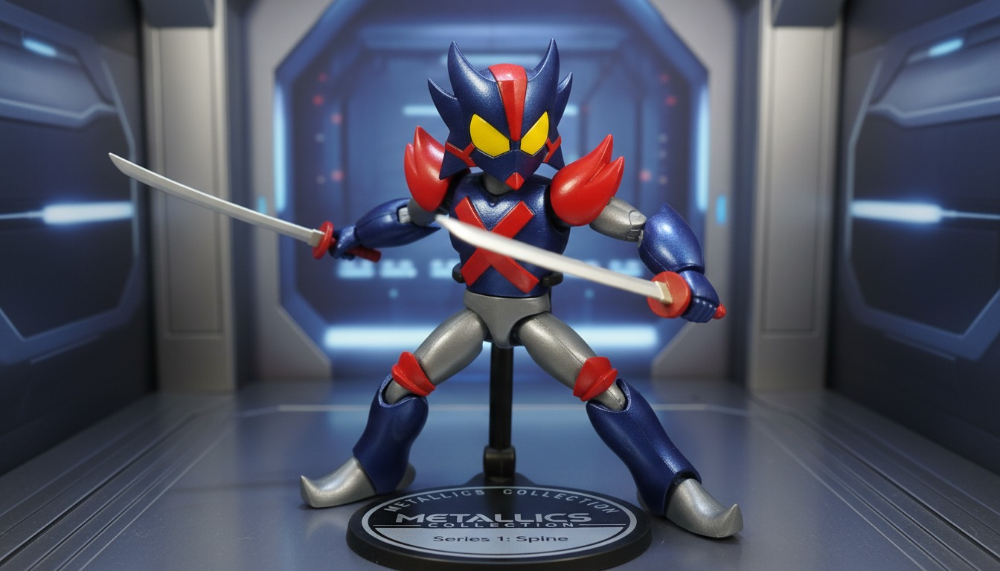

<!DOCTYPE html>
<html lang="es">
<head>
    <meta charset="UTF-8">
    <meta name="viewport" content="width=device-width, initial-scale=1.0">
    <title>Elenco</title>

    
</head>

<body>

    <h1>ELENCO</h1>

    
Personajes

    <!-- OLIVER -->
    

        <h2>OLIVER - GREENLIGHT</h2>
        

        
<strong>Lugar de nacimiento:</strong> Freewill - Estados Unidos

        
<strong>Historia:</strong>
        Un chico solitario huérfano decide convertirse en héroe cuando el lugar en el que vive,
        Freewill City, se ve amenazada por una invasión de otro mundo. Oliver y sus amigos
        deciden ser héroes con trajes o armaduras especiales para salvar a la ciudad, no solo
        por el bienestar de los ciudadanos, también para llenar un vacío emocional que Oliver
        no ha logrado superar. A partir de aquí, decidirá el rumbo que tomará su vida con su
        doble identidad.
        

    

    <!-- OTTO -->
    

        <h2>OTTO - SPINE</h2>
        

        
<strong>Lugar y fecha de nacimiento:</strong> 21 de septiembre - Freewill, Estados Unidos

        
<strong>Historia:</strong>
        Otto es un científico y viejo amigo de Oliver. Es alguien muy comprometido con su trabajo,
        aunque a veces, dependiendo de la situación, puede ser muy decidido o entrar en conflicto
        con lo que cree correcto. Se encarga de crear los trajes para su equipo, listos para salvar el mundo.
        

    

</body>
</html>
